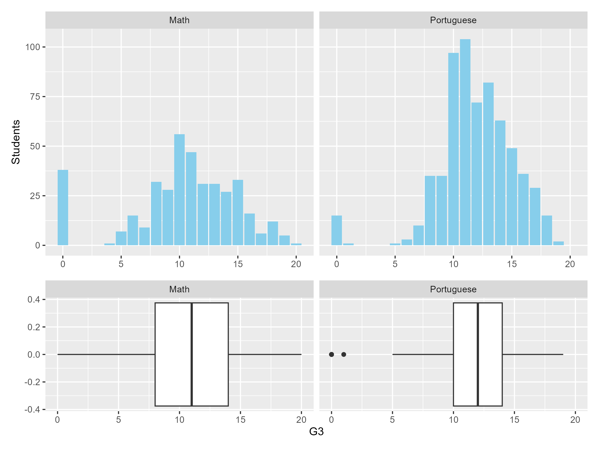
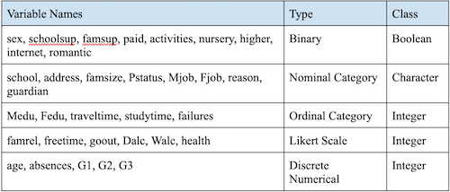
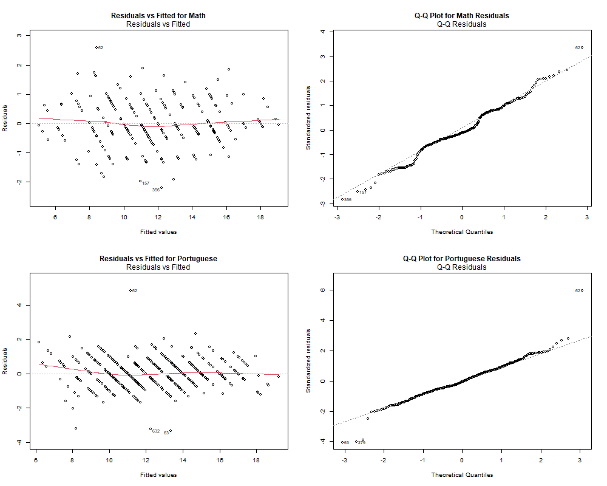

## Introduction

Education is essential to the economic growth of all countries. It is important for humans to receive primary education and secondary education both for improving society and themselves (Hanushek & WoBmann, 2010). Governments also have programs to support low income families financially so the children can get early education. One of the studies conducted for finding correlation between students’ socio-demographic background and academic performances has found that students from deprived areas perform not as well as their counterparts (Thiele, Singleton, Pope, & Stanistreet, 2014). In this paper, we are using two data sets from two schools in Portugal to determine whether we can predict student grades via their background and traits.

While it is integral to predict a student's final grade, we are more interested in the factors that influence students grades and how to influence those factors to help improve students’ performances on the final grade. This will help our target audience of educators and students alike for what they could work on to improve grades in general. We aim to predict students' final grades accurately using multiple linear regression and interpret the equation to find which qualities of students impact how much of their final grades.

## Dataset Description

The student performance is from two Portuguese secondary schools and includes student grades, demographic, social and school related features collected from school reports and surveys. The student performance data set is divided into two subjects, Math and Portuguese. Both data sets have 32 features and a predictive variable G3, the final grade students get for the subject. G1 and G2 are first and second period grades and are also strongly correlated with G3. There are no missing values.

In both data sets, there are 9 binary types, 8 nominal categorical data types, 5 ordinal categorical data types, 6 likert scale data types, and 5 discrete numerical data types of columns in the data sets. [See Appendix] G3 is a score between 0 to 20. We chose to remove rows where G3 is 0 because they are outliers and students might be absent on the final test day in which the scenario doesn’t represent how we can help students get better grades. We also found that there is an outlier in the Portuguese data set where G3 is 1 so we removed that student. After filtering, the Math data set has 357 students and the Portuguese data set has 648 students. Figure 1 shows the distribution of the predictive variable G3 for both data sets before filtering 0 and 1. (see in Appendix)

## Analysis

### Model selection

For the Model selection part, we remove the data we don't want to include through `filter(G3!=0)` and scale() function; We also use helper functions like `calculate_rmse`, `calculate_r2`, and `calculate_adj_r2` for better calculations and finding key predictor. The result table are shown below:
```{r model selection, echo=FALSE, message=FALSE,tab.cap="Model Performance Results for Portuguese and Math Datasets"}
# Load necessary libraries
library(dplyr)
library(ggplot2)
library(patchwork)
library(here)
library(car)
library(broom)
library(lm.beta)
library(MASS)
library(kableExtra)
# ------------------------------
# Helper Functions
# ------------------------------
calculate_rmse <- function(true_values, predicted_values) {
  sqrt(mean((true_values - predicted_values)^2))
}

calculate_r2 <- function(true_values, predicted_values) {
  ss_total <- sum((true_values - mean(true_values))^2)
  ss_residual <- sum((true_values - predicted_values)^2)
  1 - (ss_residual / ss_total)
}

calculate_adj_r2 <- function(r2, n, k) {
  1 - (1 - r2) * ((n - 1) / (n - k - 1))
}

extract_significant_coefs <- function(model, model_name, p_threshold = 0.1) {
  standardized_model <- lm.beta::lm.beta(model)
  tidy_model <- broom::tidy(standardized_model) %>%
    rename(standardized_estimate = estimate) %>%
    mutate(model = model_name) %>%
    filter(term != "(Intercept)" & p.value < p_threshold)
  return(tidy_model)
}
# Load the dataset and filter out rows with G3 = 0
port_data <- read.csv("student/student-por.csv", sep = ";") %>%
  filter(G3 != 0)
# Convert character columns to factors
factor_cols <- sapply(port_data, is.character)
port_data[factor_cols] <- lapply(port_data[factor_cols], factor)
# Identify Outliers in G3
port_data$G3_zscore <- scale(port_data$G3)
port_data <- port_data[abs(port_data$G3_zscore) <= 3, ]
port_data <- port_data %>% dplyr::select(-G3_zscore)
# Train-test split (70% training, 30% testing)
set.seed(42)
train_index <- sample(1:nrow(port_data), size = floor(0.7 * nrow(port_data)))
train_port <- port_data[train_index, ]
test_port <- port_data[-train_index, ]
# --- RMSE Calculation Function ---
calculate_rmse <- function(true_values, predicted_values) {
  sqrt(mean((true_values - predicted_values)^2))
}
# --- R² and Adjusted R² Calculation Functions ---
calculate_r2 <- function(true_values, predicted_values) {
  ss_total <- sum((true_values - mean(true_values))^2)
  ss_residual <- sum((true_values - predicted_values)^2)
  1 - (ss_residual / ss_total)
}
calculate_adj_r2 <- function(r2, n, k) {
  1 - (1 - r2) * ((n - 1) / (n - k - 1))
}
# --- Model Fitting ---
# 1. Initial Linear Model
lin_mod_port <- lm(G3 ~ ., data = train_port)
# Extract the summary to get p-values
lin_mod_summary <- summary(lin_mod_port)
p_values <- coef(lin_mod_summary)[, "Pr(>|t|)"]
# Identify significant predictors (p-value < 0.1), excluding the intercept
significant_terms <- names(p_values)[p_values < 0.1 & names(p_values) != "(Intercept)"]
# Map the significant terms back to the original variable names
# Get the model matrix and assign attribute
mm <- model.matrix(lin_mod_port)
assign <- attr(mm, "assign")
# Get the terms labels
terms_obj <- terms(lin_mod_port)
terms_labels <- attr(terms_obj, "term.labels")
# Map each coefficient to the corresponding variable
coef_names <- names(coef(lin_mod_port))
coef_terms <- sapply(assign, function(x) if (x == 0) "(Intercept)" else terms_labels[x])
# Create a data frame mapping coefficients to variables
coef_variable_map <- data.frame(
  term = coef_names,
  variable = coef_terms,
  stringsAsFactors = FALSE
)
# Get unique variable names corresponding to significant terms
significant_variables <- unique(coef_variable_map$variable[coef_variable_map$term %in% significant_terms])
# Create formula with significant variables
significant_formula <- as.formula(paste("G3 ~", paste(significant_variables, collapse = " + ")))
# Refit the refined Linear Model
refined_lin_mod_port <- lm(significant_formula, data = train_port)
# 2. Repeat the same process for the Log-Transformed Model
log_mod_port <- lm(log(G3) ~ ., data = train_port)
log_mod_summary <- summary(log_mod_port)
p_values_log <- coef(log_mod_summary)[, "Pr(>|t|)"]
significant_terms_log <- names(p_values_log)[p_values_log < 0.1 & names(p_values_log) != "(Intercept)"]
# Map the significant terms back to variables
mm_log <- model.matrix(log_mod_port)
assign_log <- attr(mm_log, "assign")
terms_obj_log <- terms(log_mod_port)
terms_labels_log <- attr(terms_obj_log, "term.labels")
coef_names_log <- names(coef(log_mod_port))
coef_terms_log <- sapply(assign_log, function(x) if (x == 0) "(Intercept)" else terms_labels_log[x])
coef_variable_map_log <- data.frame(
  term = coef_names_log,
  variable = coef_terms_log,
  stringsAsFactors = FALSE
)
significant_variables_log <- unique(coef_variable_map_log$variable[coef_variable_map_log$term %in% significant_terms_log])
significant_formula_log <- as.formula(paste("log(G3) ~", paste(significant_variables_log, collapse = " + ")))
# Refit the refined Log-Transformed Model
refined_log_mod_port <- lm(significant_formula_log, data = train_port)
# 3. Backward Selection Model
backward_mod_port <- stepAIC(lin_mod_port, direction = "backward", trace = FALSE)
# 4. Stepwise Selection Model
stepwise_mod_port <- stepAIC(lin_mod_port, direction = "both", trace = FALSE)
# --- Performance Metrics Calculation ---
models_port <- list(
  "Refined Linear Model" = refined_lin_mod_port,
  "Refined Log-Transformed Model" = refined_log_mod_port,
  "Backward Model" = backward_mod_port,
  "Stepwise Model" = stepwise_mod_port
)
results_port <- data.frame()
for (model_name in names(models_port)) {
  model <- models_port[[model_name]]
  
  # Number of predictors
  n_train <- nrow(train_port)
  k <- length(coef(model)) - 1  # Subtract 1 for the intercept
  
  # In-Sample Predictions
  if (grepl("log\\(G3\\)", as.character(model$call$formula)[2])) {
    # For log-transformed model, exponentiate predictions
    train_predictions <- exp(predict(model, train_port))
    test_predictions <- exp(predict(model, test_port))
  } else {
    train_predictions <- predict(model, train_port)
    test_predictions <- predict(model, test_port)
  }
  
  # In-Sample RMSE Calculation (Step by Step)
  residuals_train <- train_port$G3 - train_predictions
  squared_residuals_train <- residuals_train^2
  mse_train <- mean(squared_residuals_train)
  rmse_train <- sqrt(mse_train)
  
  # Out-of-Sample RMSE Calculation (Step by Step)
  residuals_test <- test_port$G3 - test_predictions
  squared_residuals_test <- residuals_test^2
  mse_test <- mean(squared_residuals_test)
  rmse_test <- sqrt(mse_test)
  
  # R² and Adjusted R²
  r2_train <- calculate_r2(train_port$G3, train_predictions)
  adj_r2_train <- calculate_adj_r2(r2_train, n_train, k)
  
  r2_test <- calculate_r2(test_port$G3, test_predictions)
  adj_r2_test <-calculate_adj_r2(r2_test, nrow(test_port), k)
  # Compile Results
  results_port <- rbind(results_port, data.frame(
    Model = model_name,
    Dataset = "Portguese",
    RMSE_Train = round(rmse_train, 4),
    R2_Train = round(r2_train, 4),
    Adj_R2_Train = round(adj_r2_train, 4),
    Adj_R2_Test = round(adj_r2_test, 4),
    RMSE_Test = round(rmse_test, 4),
    R2_Test = round(r2_test, 4)
  ))
}

# Load the dataset and filter out rows with G3 = 0
math_data <- read.csv("student/student-mat.csv", sep = ";") %>%
  filter(G3 != 0)
# Convert character columns to factors
factor_cols <- sapply(math_data, is.character)
math_data[factor_cols] <- lapply(math_data[factor_cols], factor)
# Note: Outliers are retained as per the current requirement
# Train-test split (70% training, 30% testing)
set.seed(42)
train_index <- sample(1:nrow(math_data), size = floor(0.7 * nrow(math_data)))
train_math <- math_data[train_index, ]
test_math <- math_data[-train_index, ]
# ------------------------------
# Part 2: Model Fitting
# ------------------------------
# Initial Linear Model for Math Dataset
lin_mod_math <- lm(G3 ~ ., data = train_math)
lin_mod_summary_math <- summary(lin_mod_math)
p_values_math <- coef(lin_mod_summary_math)[, "Pr(>|t|)"]
significant_terms_math <- names(p_values_math)[p_values_math < 0.1 & names(p_values_math) != "(Intercept)"]

# Map significant terms back to original variables
mm_math <- model.matrix(lin_mod_math)
assign_math <- attr(mm_math, "assign")
terms_obj_math <- terms(lin_mod_math)
terms_labels_math <- attr(terms_obj_math, "term.labels")
coef_names_math <- names(coef(lin_mod_math))
coef_terms_math <- sapply(assign_math, function(x) if (x == 0) "(Intercept)" else terms_labels_math[x])
coef_variable_map_math <- data.frame(
  term = coef_names_math,
  variable = coef_terms_math,
  stringsAsFactors = FALSE
)
significant_variables_math <- unique(coef_variable_map_math$variable[coef_variable_map_math$term %in% significant_terms_math])
significant_formula_math <- as.formula(paste("G3 ~", paste(significant_variables_math, collapse = " + ")))
refined_lin_mod_math <- lm(significant_formula_math, data = train_math)

# Repeat for Log-Transformed Model
log_mod_math <- lm(log(G3) ~ ., data = train_math)
log_mod_summary_math <- summary(log_mod_math)
p_values_log_math <- coef(log_mod_summary_math)[, "Pr(>|t|)"]
significant_terms_log_math <- names(p_values_log_math)[p_values_log_math < 0.1 & names(p_values_log_math) != "(Intercept)"]

mm_log_math <- model.matrix(log_mod_math)
assign_log_math <- attr(mm_log_math, "assign")
terms_obj_log_math <- terms(log_mod_math)
terms_labels_log_math <- attr(terms_obj_log_math, "term.labels")
coef_names_log_math <- names(coef(log_mod_math))
coef_terms_log_math <- sapply(assign_log_math, function(x) if (x == 0) "(Intercept)" else terms_labels_log_math[x])
coef_variable_map_log_math <- data.frame(
  term = coef_names_log_math,
  variable = coef_terms_log_math,
  stringsAsFactors = FALSE
)
significant_variables_log_math <- unique(coef_variable_map_log_math$variable[coef_variable_map_log_math$term %in% significant_terms_log_math])
significant_formula_log_math <- as.formula(paste("log(G3) ~", paste(significant_variables_log_math, collapse = " + ")))
refined_log_mod_math <- lm(significant_formula_log_math, data = train_math)
backward_mod_math <- stepAIC(lin_mod_math, direction = "backward", trace = FALSE)
stepwise_mod_math <- stepAIC(lin_mod_math, direction = "both", trace = FALSE)
# Add refined models to the list of models for evaluation
models_math <- list(
  "Refined Linear Model" = refined_lin_mod_math,
  "Refined Log-Transformed Model" = refined_log_mod_math,
  "Backward Model" = backward_mod_math,
  "Stepwise Model" = stepwise_mod_math
)

# Initialize results data frame
results_math <- data.frame()
# Evaluate each model
for (model_name in names(models_math)) {
  model <- models_math[[model_name]]
  
  # Number of predictors
  k <- length(coef(model)) - 1
  
  # Predictions
  if (model_name == "Log-Transformed Model") {
    train_predictions <- exp(predict(model, train_math))
    test_predictions <- exp(predict(model, test_math))
  } else {
    train_predictions <- predict(model, train_math)
    test_predictions <- predict(model, test_math)
  }
  
  # RMSE
  rmse_train <- calculate_rmse(train_math$G3, train_predictions)
  rmse_test <- calculate_rmse(test_math$G3, test_predictions)
  
  # R²
  r2_train <- calculate_r2(train_math$G3, train_predictions)
  r2_test <- calculate_r2(test_math$G3, test_predictions)
  
  # Adjusted R²
  adj_r2_train <- calculate_adj_r2(r2_train, nrow(train_math), k)
  adj_r2_test <- calculate_adj_r2(r2_test, nrow(test_math), k)
  
  # Compile results
  results_math <- bind_rows(results_math, data.frame(
    Model = model_name,
    Dataset = "Math",
    RMSE_Train = round(rmse_train, 4),
    R2_Train = round(r2_train, 4),
    Adj_R2_Train = round(adj_r2_train, 4),
    Adj_R2_Test = round(adj_r2_test, 4),
    RMSE_Test = round(rmse_test, 4),
    R2_Test = round(r2_test, 4)
  ))
}
final_results <- rbind(results_port,results_math)
# Display the results
knitr::kable(
  final_results,
  format = "latex", 
  caption = "Model Performance Results for Portuguese and Math Datasets", 
  booktabs = TRUE
) %>%
  kable_styling(latex_options = c("scale_down","hold_position"))
```
Based on RMSE and R² values, the backward model is most appropriate for the Portguese set, the reasons are: 1.Superior Performance: Slightly better RMSE and R² values compared to the Refined Linear Model (0.8208 vs 0.8362 in RMSE train, 0.9049 vs 0.9013 in R² train). 2.Generalization: Similar performance metrics on training and testing sets suggest the model generalizes well to unseen data. And the stepwise model is most appropriate for Math set, the reasons are: 1.it has the lowest RMSE in train (0.7774) and test (0.8520), high R² value of (0.9393 in train and 0.9328 in test) and high adjusted R² values, 2.. 

### Assumption checks (plots see in Appendix)

To assess the linearity assumption, visual inspection of the residuals vs. fitted values plots was conducted. Ideally, residuals should be randomly distributed around zero, indicating linearity. For both the Math and Portuguese datasets, scatter plots with linear regression lines between G3 and each predictor variable were examined. If the smoother (red line) in the residual plots remains near zero without a discernible pattern, the linearity assumption can be considered reasonably satisfied.
The homoscedasticity assumption requires that the variance of residuals remains constant across all fitted values, meaning that residuals should be evenly distributed around the zero line without patterns of increasing or decreasing spread. In a residual vs. fitted values plot, a constant spread of residuals suggests that homoscedasticity is likely satisfied, whereas a funnel or fan shape, where variance increases or decreases with fitted values, would indicate heteroscedasticity.
The assumption of normality of residuals is assessed using Q-Q plots for both models, where residuals should ideally fall along a 45-degree reference line, indicating a normal distribution. Deviations from this line, especially at the tails, suggest potential departures from normality; while minor deviations are generally acceptable, larger deviations, such as heavy tails, may impact the validity of the model assumptions.
The independence of residuals assumption implies that residuals are uncorrelated with one another, which is essential to ensure the validity of the model's inferences. While detecting such independence visually can be challenging, particularly in time-series or spatial data where patterns or clusters may indicate dependency, it is generally assumed in cases without time or spatial ordering, unless there are known violations in the data collection process. When all assumptions, including independence, are reasonably satisfied, the model fit is considered adequate and reliable for inference.

## Results

For the Portuguese data set, based on RMSE and R² values, the backward linear model is the most suitable, and the key factors filtered by the backward selection process are as follows. G2 (second semester grade) : has the greatest impact on final grade, with a normalization coefficient of 0.76, indicating a positive effect. G1 (first semester grade) : The normalization coefficient is 0.18, which has a strong positive effect on the final grade. traveltime (commute time) and Medu (mother's education level) also had a positive impact on the target variable, with standardization coefficients of 0.16 and 0.11, respectively. age has a positive effect on the score, but the effect is small, and the standardization coefficient is 0.09. Fjobhealth (maternal employment as a health field) has the strongest negative effect on performance, with a normalization coefficient of -0.72. Fjobteacher, Fjobother and Fjobservices also have negative effects, with coefficients of -0.43, -0.41 and -0.33, respectively. Variables such as sexM (gender being male), failures (number of school failures), and schoolMS (type of school being MS) also had negative effects, with values of -0.24, -0.18, and -0.16, respectively. absences (number of absences) had very little effect on the target variable, with a normalization coefficient close to 0. Through this study, we can note that the influence of previous grades (G1 and G2) on students' G3 grades is very large. For lower grade students, higher final grades (G3) can be obtained by improving their grades in the first and second terms. The number of academic failures has a negative impact on the score, and the coefficient is -0.18. Students can avoid the failure in the subject examination as much as possible, and improve the final score through reasonable study plan, time management and effective study methods. Having parents in certain occupations (e.g., health, teaching, other occupations, services) has a negative effect on achievement, especially in the health field (coefficient -0.72).

For the mathematics data set, the stepwise linear model is the most suitable, the key factors selected by stepwise are as follows. G2 (second semester grade) is the positive variable that has the greatest influence on the final grade (G3), and the normalization coefficient is 0.88, indicating that G2 has a great influence on G3. In other words, improving the grade in the second semester has the biggest boost to the final grade of math students. famrel (Family Relationship Quality) : The standardization coefficient is 0.14. This shows that students with better family relationships usually perform better, and family support plays a positive role in students' learning. The G1 (first semester grade) normalization coefficient of 0.10 also has a positive effect on G3, indicating that the first semester grade is still an important factor in the final grade, but its effect is much smaller than that of G2. The health standardization coefficient is 0.06, which has a small positive effect on G3, and students' health status has some effect on their final grades. In general, for math students, as well as Portuguese students, previous academic records also play a crucial role in the final score of G3, especially G2, and family relationships and maintaining good health also play a role in the final score of students.

## Discussion and conclusion

Our analysis highlights several important findings regarding factors influencing students' academic performance in Math and Portuguese. Key determinants include prior academic grades (G1 and G2), which were strong predictors of final grades (G3), and socio-demographic factors like family support, commute time, and parental occupation. For example, G2 (second term grade) showed a particularly high influence on G3, suggesting that students’ performance improves if they achieve consistently throughout the year. Furthermore, factors such as family relationships and student health demonstrated positive impacts, indicating the broader role of supportive environments on academic achievement.

This study has a few limitations that may impact the generalizability of our findings. Firstly, the reliance on linear regression and stepwise selection may simplify the complex, potentially non-linear relationships among predictors. Additionally, while prior grades and demographic factors were well-represented, some influential variables like students’ self-motivation and study habits were not included, limiting the depth of our insights.

To address these limitations, future research could explore more sophisticated, non-linear models such as random forests or decision trees, which capture complex relationships between variables more effectively. Moreover, gathering time-series data could provide insights into how student performance evolves over time, enabling more personalized predictive models. Examining interactions between factors (e.g., study time and social activities) could also produce a deeper understanding of how combined influences impact academic success.

The findings from this study provide insights for applications in educational settings. For instance, early identification of at-risk students could be achieved by monitoring G1 and G2 scores, allowing schools to offer timely interventions. Additionally, promoting family engagement and addressing health and well-being could further improve students' academic outcomes. By focusing on these predictive factors, schools can help create supportive environments that foster student growth and ultimately contribute to academic success.

Through the regression analysis of the data sets of Portuguese and mathematics, we can draw the following conclusion: Among the factors affecting students' final grades (G3), the previous grades (G1 and G2) play a crucial role, especially the second semester grades (G2) have the greatest impact on the final grades. For Portuguese students, G2 and G1 have significant positive effects, and family factors such as mother's occupation and education level also have certain effects. For math students, good family relationships and health had a positive impact on achievement. Overall, improving early grades and maintaining good family relationships and health play an important role in improving students' final grades.

\clearpage

## Appendix
Figure 1
```{r, out.width='100%', echo = FALSE, fig.show='hold'}

```
Table of summary of different type of features in both Math and Portuguese Dataset
```{r, out.width='100%', echo = FALSE, fig.show='hold'}


```

\newpage

## References

-   Cortez, P. (2014). Student Performance. Retrieved from <https://archive.ics.uci.edu/dataset/320/student+performance>.

-   Eddelbuettel, D. & Balamuta, J. (2017). pinp: Pinp is not PNAS. R package version 0.0.2,<https://cran.r-project.org/web/packages/pinp/readme/README.html>.

-   Hanushek, E., & WoBmann, L. (2010). Education and Economic Growth. Economics of Education, 1(1), 63. Retrieved from <https://www.google.com.au/books/edition/The_Economics_of_Education/s-jEkQEACAAJ?hl=en>.

-   Pedersen T (2024). patchwork: The Composer of Plots. R package version 1.3.0.9000, [https://github.com/thomasp85/patchwork, https://patchwork.data-imaginist.com](https://github.com/thomasp85/patchwork,%20https://patchwork.data-imaginist.com).

-   Thiele, T., Singleton, A., Pope, D., & Stanistreet, D. (2014). Predicting students' academic performance based on school and socio-demographic characteristics. Studies in Higher Education, 41(8), 1424–1446.<https://doi.org/10.1080/03075079.2014.974528>.

-   Wickham H (2016). ggplot2: Elegant Graphics for Data Analysis. Springer-Verlag New York. ISBN 978-3-319-24277-4, <https://ggplot2.tidyverse.org>.

-   Wickham H, François R, Henry L, Müller K, Vaughan D (2023). dplyr: A Grammar of Data Manipulation. R package version 1.1.4, <https://dplyr.tidyverse.org>.
